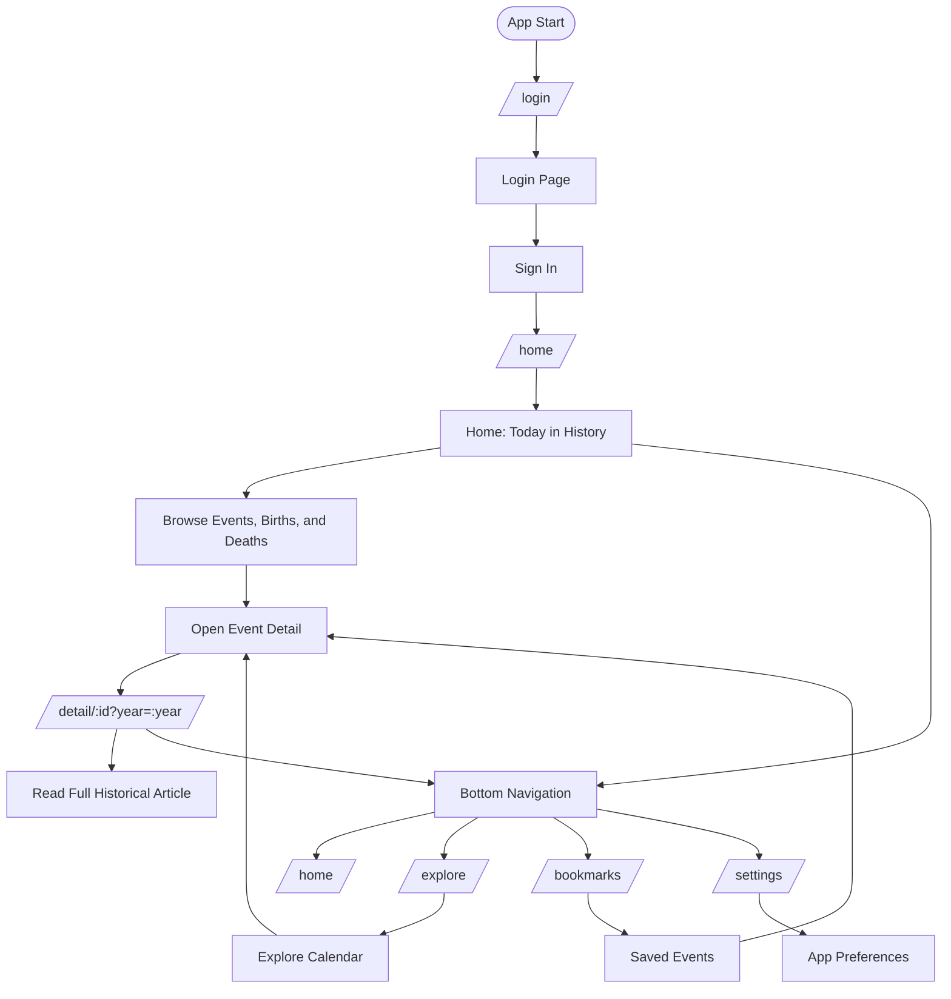
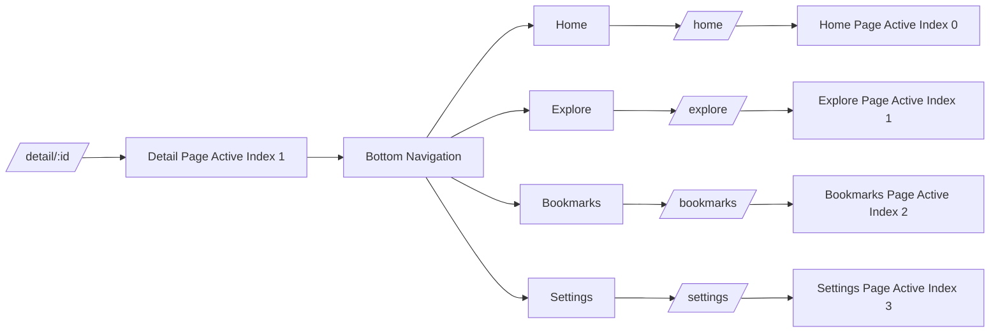
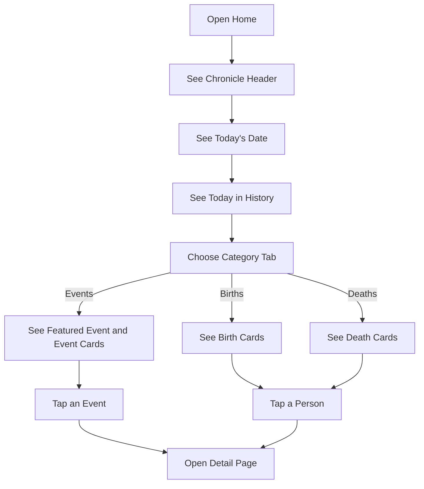
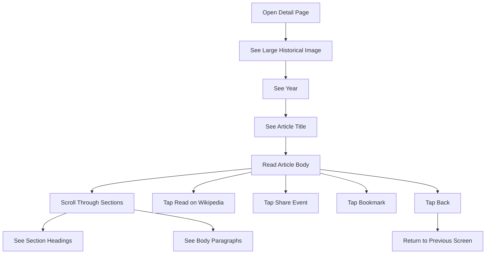
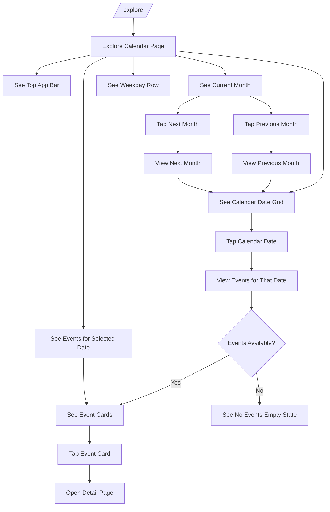
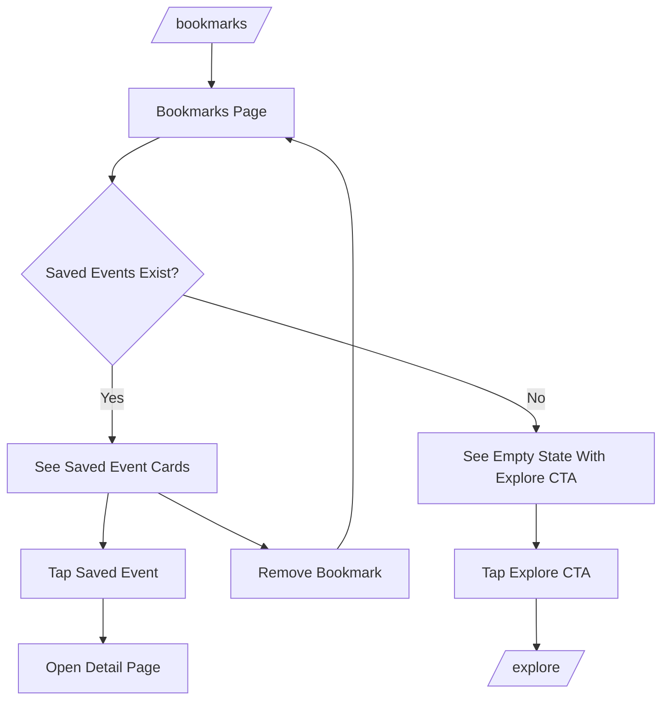
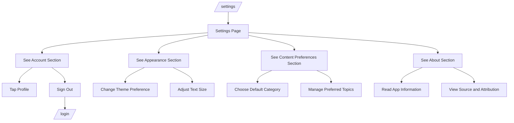

# Chronicle User Flow

This document describes the user experience flow for Chronicle: what users see, choose, and navigate through in the app.

## Route Map

| Route | Screen | Status | Notes |
| --- | --- | --- | --- |
| `/login` | Login page | Implemented | Initial route. Sign In navigates to `/home`. |
| `/home` | Home page | Implemented | Shows today's history, category tabs, featured card, and article list. |
| `/detail/:id?year=:year` | Event detail page | Implemented | Shows a long-form historical article. Bottom nav marks Explore active. |
| `/explore` | Explore calendar page | Planned design | Browse historical events by month and selected date. |
| `/bookmarks` | Bookmarks page | Planned design | Review saved historical events. |
| `/settings` | Settings page | Planned design | Manage app preferences and account options. |

## Main User Flow

## Bottom Navigation Flow

## Home Page Content Flow

## Detail Page Content Flow

## Explore Calendar Page Flow

## Bookmarks Page Flow

## Settings Page Flow

## Important Current Behaviors

- The app starts at `/login`.
- Sign In is the only login action currently wired to route forward.
- Google, Apple, Forgot Password, and Sign Up are visual actions only for now.
- Home presents historical items for the current date.
- Detail pages present long-form article content when available.
- Detail page back and bookmark buttons are fixed overlays.
- Detail page marks Explore active in the bottom navigation.
- Explore is represented as the calendar-based design from Stitch: month navigation, date selection, and events for the selected day.
- Bookmarks and Settings are represented in this flow as complete intended app screens.
